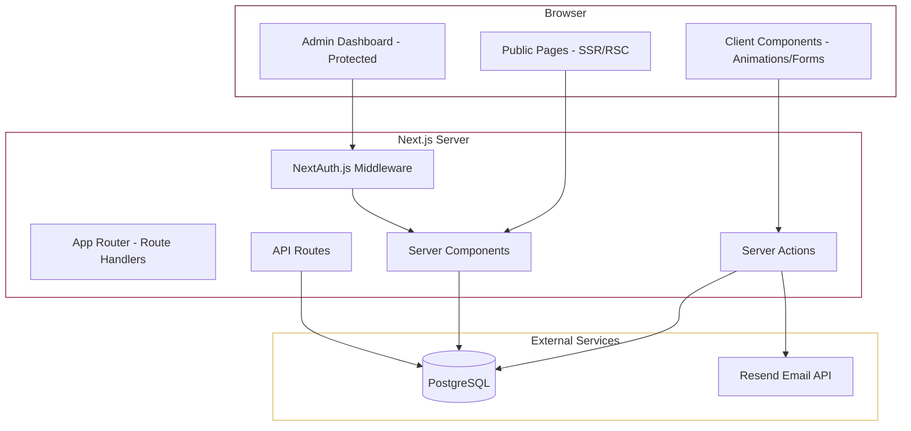
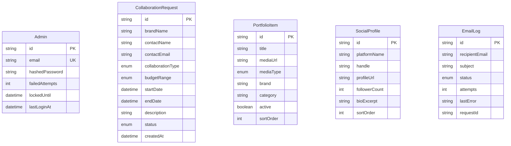

# Design Document: Influencer Portfolio Site

## Overview

This design describes a premium portfolio and collaboration platform for a single influencer. The application is a full-stack Next.js 14+ site using the App Router, TypeScript strict mode, Tailwind CSS, Framer Motion, PostgreSQL (via Prisma ORM), NextAuth.js for authentication, and Resend for transactional email.

The site has two audiences:
1. **Public visitors** — experience a story-driven homepage, browse social profiles, view collaborations, and submit collaboration requests.
2. **Admin (the influencer)** — manages collaboration requests, portfolio items, and social profiles through a protected dashboard.

The visual identity uses a luxury palette (cabernet `#540212`, maroon `#800020`, gold `#D6B24C`) against white, with glossy/glow animations powered by Framer Motion.

### Key Design Decisions

| Decision | Rationale |
|----------|-----------|
| Next.js App Router with Server Components by default | Minimizes client JS bundle; pages that need interactivity (scroll animations, forms) use `"use client"` selectively |
| Prisma with PostgreSQL | Type-safe data access, declarative schema, easy migrations |
| NextAuth.js Credentials provider | Single admin user; no OAuth complexity needed |
| Resend for email | Simple API, React Email templates, reliable delivery |
| Framer Motion `useInView` + `useScroll` | Native intersection observer integration for scroll-triggered animations without extra libraries |
| Server Actions for form mutations | Collocated validation and database writes; progressive enhancement |
| Tailwind CSS with custom theme | Luxury palette defined once in `tailwind.config.ts`, consistent across components |

## Architecture

### High-Level Architecture



### Project Structure

```
src/
├── app/
│   ├── (public)/                  # Public route group
│   │   ├── page.tsx               # Homepage (story-driven scroll)
│   │   ├── profiles/page.tsx      # Social media profiles
│   │   ├── collaborations/page.tsx # Collaborations showcase
│   │   └── collaborate/page.tsx   # Collaboration request form
│   ├── (admin)/                   # Admin route group
│   │   ├── layout.tsx             # Dashboard layout with sidebar
│   │   ├── dashboard/page.tsx     # Overview metrics
│   │   ├── dashboard/requests/    # Manage requests
│   │   ├── dashboard/portfolio/   # Manage portfolio items
│   │   └── dashboard/profiles/    # Manage social profiles
│   ├── api/
│   │   └── auth/[...nextauth]/route.ts
│   ├── layout.tsx                 # Root layout
│   └── globals.css
├── components/
│   ├── ui/                        # Reusable UI primitives
│   ├── homepage/                  # Story section components
│   ├── profiles/                  # Profile card components
│   ├── collaborations/            # Carousel, portfolio items
│   ├── forms/                     # Form components
│   └── dashboard/                 # Admin dashboard components
├── lib/
│   ├── prisma.ts                  # Prisma client singleton
│   ├── auth.ts                    # NextAuth configuration
│   ├── email.ts                   # Resend client and templates
│   ├── validators.ts             # Zod schemas for validation
│   └── utils.ts                   # Shared utilities
├── actions/                       # Server Actions
│   ├── collaboration-requests.ts
│   ├── portfolio.ts
│   └── profiles.ts
├── prisma/
│   ├── schema.prisma
│   ├── migrations/
│   └── seed.ts
└── types/                         # Shared TypeScript types
    └── index.ts
```

### Rendering Strategy

| Route | Rendering | Reason |
|-------|-----------|--------|
| Homepage | SSR + Client hydration | Static structure server-rendered; Framer Motion animations client-side |
| Profiles | SSR + Client interactivity | Profile list server-rendered; selection/preview is client-side |
| Collaborations | SSR + Client carousel | Portfolio data fetched server-side; carousel interaction client-side |
| Collaborate (form) | SSR + Client form | Form shell server-rendered; validation and submission client-side via Server Action |
| Dashboard pages | SSR (protected) | Data fetched server-side behind auth middleware |

## Components and Interfaces

### Public Components

#### StorySection (Homepage)

```typescript
interface StorySectionProps {
  id: string;
  children: React.ReactNode;
  animationVariant?: 'fadeUp' | 'fadeIn' | 'slideLeft' | 'slideRight';
  parallaxOffset?: number; // 20-60px
  threshold?: number; // 0.25 default (25% visibility trigger)
}
```

Uses Framer Motion's `useInView` hook with `amount: 0.25` to trigger fade-in animations when 25% of the section enters the viewport. Parallax effect achieved via `useScroll` + `useTransform`.

#### AnimatedCounter (Stats Section)

```typescript
interface AnimatedCounterProps {
  target: number;
  duration?: number; // 1-2 seconds
  prefix?: string;
  suffix?: string;
  formatNumber?: boolean;
}
```

Animates from 0 to target using Framer Motion's `useMotionValue` and `useTransform`, triggered by `useInView`.

#### ProfileCard

```typescript
interface ProfileCardProps {
  platform: string;
  handle: string | null;
  followerCount: number | null;
  bioExcerpt: string | null; // max 150 chars
  profileUrl: string;
  iconUrl?: string;
}
```

#### CollaborationCarousel

```typescript
interface CollaborationCarouselProps {
  items: PortfolioItemWithBrand[];
  autoPlay?: boolean;
  transitionDuration?: number; // 300-500ms
}
```

Uses Framer Motion's `AnimatePresence` with slide/fade variants for transitions between items.

#### CollaborationRequestForm

```typescript
interface CollaborationFormData {
  brandName: string;        // max 100 chars
  contactName: string;      // max 100 chars
  contactEmail: string;     // valid email
  collaborationType: CollaborationType;
  budgetRange: BudgetRange;
  startDate: string;        // ISO date, >= today
  endDate: string;          // ISO date, >= startDate
  description: string;      // max 1000 chars
}

type CollaborationType = 
  | 'sponsored_post' 
  | 'product_review' 
  | 'brand_ambassador' 
  | 'giveaway' 
  | 'event_appearance' 
  | 'other';

type BudgetRange = 
  | 'under_500' 
  | '500_1000' 
  | '1000_5000' 
  | '5000_10000' 
  | 'over_10000';
```

### Admin Components

#### DashboardMetrics

```typescript
interface DashboardMetricsData {
  pendingRequests: number;
  totalRequests: number;
  acceptedCollaborations: number;
}
```

#### RequestsTable

```typescript
interface RequestsTableProps {
  requests: CollaborationRequestSummary[];
  currentFilter: RequestStatus | 'all';
  onFilterChange: (status: RequestStatus | 'all') => void;
  onStatusChange: (id: string, newStatus: RequestStatus) => void;
}
```

#### PortfolioManager

```typescript
interface PortfolioManagerProps {
  items: PortfolioItemWithBrand[];
  currentPage: number;
  totalPages: number;
}
```

### Server Actions

```typescript
// actions/collaboration-requests.ts
export async function submitCollaborationRequest(
  formData: CollaborationFormData
): Promise<ActionResult<{ id: string }>>;

export async function updateRequestStatus(
  requestId: string,
  status: RequestStatus
): Promise<ActionResult<void>>;

// actions/portfolio.ts
export async function createPortfolioItem(
  data: CreatePortfolioItemData
): Promise<ActionResult<{ id: string }>>;

export async function updatePortfolioItem(
  id: string,
  data: UpdatePortfolioItemData
): Promise<ActionResult<void>>;

export async function deletePortfolioItem(
  id: string
): Promise<ActionResult<void>>;

export async function togglePortfolioItemStatus(
  id: string,
  active: boolean
): Promise<ActionResult<void>>;

// actions/profiles.ts
export async function createSocialProfile(
  data: CreateProfileData
): Promise<ActionResult<{ id: string }>>;

export async function updateSocialProfile(
  id: string,
  data: UpdateProfileData
): Promise<ActionResult<void>>;

export async function deleteSocialProfile(
  id: string
): Promise<ActionResult<void>>;
```

### Shared Types

```typescript
interface ActionResult<T> {
  success: boolean;
  data?: T;
  error?: string;
  fieldErrors?: Record<string, string[]>;
}

type RequestStatus = 'pending' | 'accepted' | 'rejected' | 'completed';
```

### Premium Visual Effects System

The visual effects layer creates the luxury feel through layered CSS animations, Tailwind utilities, and Framer Motion. All effects are defined in a centralized theme system for consistency.

#### Tailwind Theme Extensions (`tailwind.config.ts`)

```typescript
// Premium color palette with opacity variants
const premiumColors = {
  cabernet: { DEFAULT: '#540212', light: '#6b0318', glow: 'rgba(84,2,18,0.3)' },
  maroon: { DEFAULT: '#800020', light: '#990026', glow: 'rgba(128,0,32,0.3)' },
  gold: { DEFAULT: '#D6B24C', light: '#e0c060', glow: 'rgba(214,178,76,0.4)' },
};

// Custom keyframes for premium animations
const keyframes = {
  'shine-sweep': {
    '0%': { transform: 'translateX(-100%) skewX(-15deg)' },
    '100%': { transform: 'translateX(200%) skewX(-15deg)' },
  },
  'glow-pulse': {
    '0%, 100%': { opacity: '0.08' },
    '50%': { opacity: '0.12' },
  },
  'press': {
    '0%': { transform: 'scale(1)' },
    '50%': { transform: 'scale(0.97)' },
    '100%': { transform: 'scale(1)' },
  },
};

const animation = {
  'shine-sweep': 'shine-sweep 2s ease-in-out infinite 8s',
  'glow-pulse': 'glow-pulse 3s ease-in-out infinite',
  'press': 'press 200ms ease-out',
};
```

#### Button Component Variants

```typescript
interface PremiumButtonProps {
  variant: 'primary' | 'secondary' | 'ghost';
  size?: 'sm' | 'md' | 'lg';
  children: React.ReactNode;
  className?: string;
}

// Primary: gradient fill maroon→cabernet, white text, glow on hover
// Secondary: transparent + gold border, gold text, fills gold on hover
// Ghost: no border, accent text, underline animation on hover

// Tailwind classes for primary button:
// bg-gradient-to-r from-maroon to-cabernet text-white font-semibold
// tracking-[0.5px] rounded-[10px] min-h-[48px] px-8
// transition-all duration-200 ease-out
// hover:scale-[1.03] hover:shadow-[0_8px_25px_rgba(128,0,32,0.3)] hover:brightness-110
// active:animate-press
// relative overflow-hidden [&::after]:shine-sweep-pseudo
```

#### Shine Sweep Effect (CSS pseudo-element)

```css
/* Applied via Tailwind plugin or globals.css */
.shine-overlay::after {
  content: '';
  position: absolute;
  inset: 0;
  background: linear-gradient(
    105deg,
    transparent 40%,
    rgba(255, 255, 255, 0.15) 45%,
    rgba(255, 255, 255, 0.25) 50%,
    rgba(255, 255, 255, 0.15) 55%,
    transparent 60%
  );
  animation: shine-sweep 2s ease-in-out;
  animation-delay: 1s;
  animation-iteration-count: infinite;
  animation-duration: 8s;
  pointer-events: none;
}
```

#### Noise Texture Overlay

```css
/* Subtle grain texture on colored backgrounds */
.premium-texture::before {
  content: '';
  position: absolute;
  inset: 0;
  background-image: url('/textures/noise.svg');
  opacity: 0.03;
  mix-blend-mode: overlay;
  pointer-events: none;
}
```

The noise SVG is a 200×200 `<feTurbulence>` filter rendered to a tiny repeating tile for minimal file size (~400 bytes).

#### Card Hover Effect (Framer Motion)

```typescript
const cardHoverVariants = {
  rest: {
    y: 0,
    boxShadow: '0 4px 12px rgba(0,0,0,0.06)',
    borderColor: 'rgba(214,178,76,0)',
    transition: { duration: 0.25, ease: 'easeOut' },
  },
  hover: {
    y: -4,
    boxShadow: '0 12px 30px rgba(0,0,0,0.12)',
    borderColor: 'rgba(214,178,76,0.4)',
    transition: { duration: 0.25, ease: 'easeOut' },
  },
};
```

#### Glass Navigation Bar

```typescript
// Activated when scroll position > hero section height
const navGlassStyles = {
  backdropFilter: 'blur(14px)',
  backgroundColor: 'rgba(255, 255, 255, 0.7)',
  borderBottom: '1px solid rgba(255, 255, 255, 0.2)',
  transition: 'all 300ms ease-out',
};
```

#### Gold Spotlight Glow (Behind Headings)

```typescript
// Radial gradient positioned behind key headings
const spotlightGlow = {
  background: 'radial-gradient(ellipse at center, rgba(214,178,76,0.10) 0%, transparent 70%)',
  width: '400px',
  height: '200px',
  position: 'absolute' as const,
  zIndex: -1,
  animation: 'glow-pulse 3s ease-in-out infinite',
};
```

#### Navigation Link Underline Animation

```typescript
// Gold gradient underline that expands from 0% to 100% on hover
// Implemented via Tailwind:
// relative after:absolute after:bottom-0 after:left-0
// after:h-[2px] after:w-0 after:bg-gradient-to-r after:from-gold after:to-gold/50
// after:transition-all after:duration-300 after:ease-in-out
// hover:after:w-full
```

#### Staggered Nav Entrance (Framer Motion)

```typescript
const navContainerVariants = {
  hidden: {},
  visible: {
    transition: { staggerChildren: 0.05 }, // 50ms between items
  },
};

const navItemVariants = {
  hidden: { opacity: 0, y: 8 },
  visible: { opacity: 1, y: 0, transition: { duration: 0.3 } },
};
```

## Data Models

### Prisma Schema

```prisma
generator client {
  provider = "prisma-client-js"
}

datasource db {
  provider = "postgresql"
  url      = env("DATABASE_URL")
}

model Admin {
  id             String   @id @default(cuid())
  email          String   @unique
  hashedPassword String
  failedAttempts Int      @default(0)
  lockedUntil    DateTime?
  lastLoginAt    DateTime?
  createdAt      DateTime @default(now())
  updatedAt      DateTime @updatedAt
}

model CollaborationRequest {
  id                String            @id @default(cuid())
  brandName         String            @db.VarChar(100)
  contactName       String            @db.VarChar(100)
  contactEmail      String
  collaborationType CollaborationType
  budgetRange       BudgetRange
  startDate         DateTime
  endDate           DateTime
  description       String            @db.VarChar(1000)
  status            RequestStatus     @default(PENDING)
  createdAt         DateTime          @default(now())
  updatedAt         DateTime          @updatedAt

  @@index([status])
  @@index([createdAt(sort: Desc)])
}

model PortfolioItem {
  id        String   @id @default(cuid())
  title     String   @db.VarChar(100)
  mediaUrl  String
  mediaType MediaType
  brand     String
  category  String
  active    Boolean  @default(true)
  sortOrder Int      @default(0)
  createdAt DateTime @default(now())
  updatedAt DateTime @updatedAt

  @@index([active])
  @@index([sortOrder])
}

model SocialProfile {
  id            String   @id @default(cuid())
  platformName  String
  handle        String   @db.VarChar(100)
  profileUrl    String
  followerCount Int
  bioExcerpt    String?  @db.VarChar(300)
  iconUrl       String?
  sortOrder     Int      @default(0)
  createdAt     DateTime @default(now())
  updatedAt     DateTime @updatedAt
}

model EmailLog {
  id          String      @id @default(cuid())
  recipientEmail String
  subject     String
  status      EmailStatus
  attempts    Int         @default(0)
  lastError   String?
  requestId   String?
  createdAt   DateTime    @default(now())
  updatedAt   DateTime    @updatedAt
}

enum CollaborationType {
  SPONSORED_POST
  PRODUCT_REVIEW
  BRAND_AMBASSADOR
  GIVEAWAY
  EVENT_APPEARANCE
  OTHER
}

enum BudgetRange {
  UNDER_500
  RANGE_500_1000
  RANGE_1000_5000
  RANGE_5000_10000
  OVER_10000
}

enum RequestStatus {
  PENDING
  ACCEPTED
  REJECTED
  COMPLETED
}

enum MediaType {
  IMAGE
  VIDEO
}

enum EmailStatus {
  PENDING
  SENT
  FAILED
}
```

### Entity Relationships



## Correctness Properties

*A property is a characteristic or behavior that should hold true across all valid executions of a system — essentially, a formal statement about what the system should do. Properties serve as the bridge between human-readable specifications and machine-verifiable correctness guarantees.*

### Property 1: Collaboration request round-trip preservation

*For any* valid collaboration request data (brand name, contact name, email, collaboration type, budget range, dates, description), storing the request and then retrieving it by ID should return an object with all original field values preserved exactly, and the status should be "pending".

**Validates: Requirements 3.2, 7.2**

### Property 2: Collaboration request form validation

*For any* collaboration request form submission where at least one required field is empty OR the contact email does not match a valid email format OR dates are in the past, the system should reject the submission, return field-specific error messages for each invalid field, and not persist any data to the database.

**Validates: Requirements 3.3, 3.4**

### Property 3: Email notification content correctness

*For any* successfully stored collaboration request, the email notification sent to the admin should contain the request's brand name, contact email, and collaboration type as they were submitted.

**Validates: Requirements 3.5**

### Property 4: Portfolio item categorization by status

*For any* set of portfolio items with associated collaboration statuses, items linked to collaborations with status "accepted" should appear exclusively in the Active section, and items linked to collaborations with status "rejected" or "completed" should appear exclusively in the Past section.

**Validates: Requirements 4.3**

### Property 5: Dashboard route protection

*For any* route under the admin dashboard path, an unauthenticated request should result in a redirect to the login page and never return dashboard content.

**Validates: Requirements 5.3**

### Property 6: Account lockout after consecutive failures

*For any* sequence of 5 consecutive failed login attempts within a 15-minute window, the account should become locked for 15 minutes. During the lockout period, even valid credentials should be rejected. After the lockout period expires, valid credentials should succeed.

**Validates: Requirements 5.7**

### Property 7: Dashboard metrics computation

*For any* set of collaboration requests with various statuses (pending, accepted, rejected, completed), the dashboard metrics should report: pending count equal to the number of requests with status "pending", total count equal to the total number of requests, and accepted count equal to the number of requests with status "accepted".

**Validates: Requirements 6.1**

### Property 8: Recent requests ordering

*For any* set of collaboration requests with distinct creation timestamps, the dashboard overview should return exactly the 5 most recent requests ordered by submission date descending (newest first).

**Validates: Requirements 6.2**

### Property 9: Request list filtering

*For any* set of collaboration requests and any selected status filter (pending, accepted, rejected), the filtered list should contain only requests matching that status, and when no filter is selected, all requests should be shown sorted by date descending.

**Validates: Requirements 7.1, 7.6**

### Property 10: Status update persistence

*For any* collaboration request and any valid target status (accepted, rejected), confirming a status change should persist the new status to the database, and subsequent retrieval of that request should reflect the updated status.

**Validates: Requirements 7.4**

### Property 11: Title truncation

*For any* portfolio item title, if the title length exceeds 80 characters, the displayed title should be exactly 80 characters followed by an ellipsis ("…"). If the title is 80 characters or fewer, it should be displayed in full without modification.

**Validates: Requirements 8.1**

### Property 12: Portfolio item creation with active status

*For any* valid portfolio item data (title ≤ 100 chars, accepted media format, file ≤ 50MB, brand name, category), creating the item should store it with active status set to true, and it should appear in public portfolio queries.

**Validates: Requirements 8.2**

### Property 13: Portfolio item validation

*For any* portfolio item submission where a required field is missing OR the file exceeds 50MB OR the file format is not in (JPEG, PNG, GIF, MP4, MOV), the system should reject the submission with an error message identifying the specific constraint that failed, and not store the item.

**Validates: Requirements 8.3**

### Property 14: Inactive portfolio items excluded from public queries

*For any* portfolio item that has been toggled to inactive, public-facing queries for portfolio items should not include that item, but the item should still exist in the database with all its data intact.

**Validates: Requirements 8.5**

### Property 15: Social profile validation

*For any* social profile submission where the platform name, handle, profile URL, or follower count is missing, OR the profile URL is not a valid URL format, OR the follower count is not a whole number between 0 and 999,999,999, OR the handle exceeds 100 characters, OR the bio excerpt exceeds 300 characters, the system should reject the submission with appropriate error messages and not store the profile.

**Validates: Requirements 9.3, 9.4, 9.7**

### Property 16: Social profile round-trip

*For any* valid social profile data (platform name, handle ≤ 100 chars, valid URL, follower count 0–999,999,999, optional bio ≤ 300 chars), creating the profile and then retrieving it should return all original field values preserved, and the profile should appear on the public profiles page.

**Validates: Requirements 9.2, 9.5**

### Property 17: Email retry logic

*For any* email send attempt that fails, the system should retry up to 3 times with a delay between attempts. If all 3 retries fail, the system should log the failure and mark the email as failed, while the associated collaboration request retains its pending status unchanged.

**Validates: Requirements 11.6, 3.6**

### Property 18: Profile_Card graceful degradation

*For any* social profile where one or more optional display fields (handle, follower count, bio excerpt) are null, the Profile_Card component should render without errors, display all non-null fields, and omit null fields from the rendered output entirely.

**Validates: Requirements 2.5**

### Property 19: Premium button hover state

*For any* primary or secondary button component rendered on the page, hovering over the button should produce a computed transform containing scale(1.03), a box-shadow with a blur radius of at least 20px, and a filter brightness value of at least 1.1. Removing hover should return all properties to their resting values within 200ms.

**Validates: Requirements 12.3, 12.5, 12.6**

### Property 20: Shine sweep on colored backgrounds

*For any* DOM element with a background color matching cabernet (#540212), maroon (#800020), or gold (#D6B24C), the element should contain a pseudo-element or child with a CSS animation named "shine-sweep" that has a duration between 1.5 and 2.5 seconds and repeats infinitely.

**Validates: Requirements 12.1**

### Property 21: Card hover elevation

*For any* card component (Profile_Card, category card, Portfolio_Item card), hovering should produce a translateY of -4px and a box-shadow with a vertical offset of at least 10px. The transition duration should be between 200 and 300 milliseconds.

**Validates: Requirements 12.7**

## Error Handling

### Client-Side Errors

| Scenario | Handling |
|----------|----------|
| Form validation failure | Display inline field-level errors using Zod validation; prevent submission |
| Network request failure | Display toast notification with retry option; preserve form state |
| Image/video load failure | Show fallback placeholder (cabernet background for hero, gray placeholder for portfolio) |
| Session expiration | Redirect to login with "session expired" message |

### Server-Side Errors

| Scenario | Handling |
|----------|----------|
| Database connection failure | Return 503 with user-friendly error page; log to server console |
| Email send failure | Retry up to 3 times with 5-second delay; log failure; do not block request storage |
| File upload exceeds limit | Return 413 with specific error message before processing |
| Invalid file format | Return 400 with accepted formats list |
| Authentication failure | Return generic "Invalid credentials" message; increment failed attempt counter |
| Account lockout | Return 429 with lockout duration message |
| Concurrent status update | Use optimistic locking via `updatedAt` field; return conflict error if stale |

### Error Response Format

```typescript
interface ErrorResponse {
  success: false;
  error: string;           // User-friendly message
  code?: string;           // Machine-readable error code
  fieldErrors?: Record<string, string[]>; // Field-level validation errors
}
```

### Logging Strategy

- **Error level**: Database failures, email send failures after retries, authentication anomalies
- **Warn level**: Rate limiting triggers, file upload rejections, session expirations
- **Info level**: Successful collaboration request submissions, status changes, admin logins

## Testing Strategy

### Testing Framework

- **Unit/Integration Tests**: Vitest (fast, TypeScript-native, compatible with Next.js)
- **Property-Based Tests**: fast-check (with Vitest)
- **E2E Tests**: Playwright (for critical user flows)
- **Component Tests**: React Testing Library (with Vitest)

### Property-Based Testing Configuration

Each property test uses `fast-check` with a minimum of 100 iterations:

```typescript
import { fc } from 'fast-check';
import { test } from 'vitest';

// Feature: influencer-portfolio-site, Property 1: Collaboration request round-trip preservation
test.prop([validCollaborationRequestArb], { numRuns: 100 })(
  'stored request preserves all fields',
  (request) => { /* ... */ }
);
```

**Tag format**: `Feature: influencer-portfolio-site, Property {number}: {property_text}`

### Test Categories

| Category | Tool | Focus |
|----------|------|-------|
| Property tests | fast-check + Vitest | Universal properties (Properties 1–18) |
| Unit tests | Vitest | Specific examples, edge cases, utility functions |
| Integration tests | Vitest + Prisma test utils | Database operations, API routes, auth flows |
| E2E tests | Playwright | Critical user journeys (submit request, admin login, manage portfolio) |
| Visual regression | Playwright screenshots | Responsive layout, color palette, animations |

### Test Organization

```
tests/
├── properties/              # Property-based tests
│   ├── collaboration-requests.prop.test.ts
│   ├── portfolio-items.prop.test.ts
│   ├── social-profiles.prop.test.ts
│   ├── dashboard-metrics.prop.test.ts
│   ├── auth.prop.test.ts
│   └── email.prop.test.ts
├── unit/                    # Unit tests
│   ├── validators.test.ts
│   ├── truncation.test.ts
│   └── categorization.test.ts
├── integration/             # Integration tests
│   ├── api/
│   └── db/
└── e2e/                     # End-to-end tests
    ├── homepage.spec.ts
    ├── collaboration-form.spec.ts
    └── admin-dashboard.spec.ts
```

### Key Testing Decisions

- **Prisma**: Use a test database with migrations applied before test suite; reset between test files using transactions
- **Email**: Mock Resend client in unit/property tests; use Resend test mode for integration tests
- **Auth**: Mock NextAuth session in component tests; test real auth flow in E2E
- **File uploads**: Mock file system in unit tests; use temp directories in integration tests
- **Animations**: Skip animation testing in unit tests; verify animation classes/props exist; E2E for visual confirmation


---

## Correctness Properties

*A property is a characteristic or behavior that should hold true across all valid executions of a system — essentially, a formal statement about what the system should do. Properties serve as the bridge between human-readable specifications and machine-verifiable correctness guarantees.*

### Property 1: Valid collaboration form submission round-trip

*For any* valid collaboration form data (brand name ≤100 chars, contact name ≤100 chars, valid email, valid collaboration type, valid budget range, start date ≥ today, end date ≥ start date, description ≤1000 chars), submitting the form SHALL result in a stored CollaborationRequest with status "pending" whose fields match the submitted data exactly.

**Validates: Requirements 3.2**

### Property 2: Invalid collaboration form data is rejected with field-specific errors

*For any* collaboration form submission where at least one required field is empty OR the email is not in valid format, the system SHALL reject the submission without storing any data and SHALL return validation errors identifying each invalid field.

**Validates: Requirements 3.3, 3.4**

### Property 3: Collaboration categorization by status

*For any* set of portfolio items linked to collaborations, categorizing them SHALL place all items with "accepted" status into the Active section and all items with "rejected" or "completed" status into the Past section, with no item appearing in both sections and no item missing from its correct section.

**Validates: Requirements 4.3**

### Property 4: Unauthenticated dashboard access redirects to login

*For any* dashboard route (overview, requests, portfolio, profiles), an unauthenticated request SHALL result in a redirect to the login page.

**Validates: Requirements 5.3**

### Property 5: Account lockout after consecutive failed login attempts

*For any* sequence of login attempts for a given email, if 5 or more consecutive failures occur within a 15-minute window, the system SHALL lock the account for 15 minutes and reject subsequent login attempts regardless of credential validity.

**Validates: Requirements 5.7**

### Property 6: Dashboard summary counts are consistent with request data

*For any* set of CollaborationRequests in the database, the dashboard summary SHALL report: pending count equal to the number of requests with status "pending", total count equal to the total number of requests, and accepted count equal to the number of requests with status "accepted".

**Validates: Requirements 6.1**

### Property 7: Request listing is always in descending date order

*For any* query of CollaborationRequests (whether the full list or the recent-5 overview), the results SHALL be ordered by submission date in strictly descending order (newest first).

**Validates: Requirements 6.2, 7.1**

### Property 8: Request status filtering returns only matching items

*For any* set of CollaborationRequests and any selected status filter (pending, accepted, or rejected), the filtered results SHALL contain only requests whose status matches the filter, and SHALL contain all requests with that status.

**Validates: Requirements 7.6**

### Property 9: Confirmed status change persists correctly

*For any* CollaborationRequest and any valid target status (accepted or rejected), confirming a status change SHALL update the request's status in the database to the target value and the updated status SHALL be reflected in subsequent queries.

**Validates: Requirements 7.4**

### Property 10: Portfolio pagination returns correct page slices

*For any* set of N portfolio items and a page size P, requesting page K SHALL return items at indices [(K-1)*P, min(K*P, N)) from the full sorted list, and the total count SHALL equal N.

**Validates: Requirements 8.1**

### Property 11: Valid portfolio item creation stores as active

*For any* valid portfolio item data (title ≤100 chars, accepted file format and size ≤50MB, non-empty brand name and category), creating the item SHALL store it with active=true and it SHALL appear in public portfolio queries.

**Validates: Requirements 8.2**

### Property 12: Invalid portfolio item data is rejected

*For any* portfolio item submission with at least one missing required field OR a file exceeding 50MB OR a file in an unsupported format, the system SHALL reject the submission with an error message identifying the constraint that failed, and SHALL NOT store the item.

**Validates: Requirements 8.3**

### Property 13: Inactive portfolio items are excluded from public queries

*For any* portfolio item with active=false, the item SHALL NOT appear in any public-facing portfolio query results.

**Validates: Requirements 8.5**

### Property 14: Valid social profile creation round-trip

*For any* valid social profile data (non-empty platform name, handle ≤100 chars, valid URL, follower count 0–999,999,999, optional bio ≤300 chars), creating the profile SHALL store it and it SHALL appear on the public profiles page with all provided fields.

**Validates: Requirements 9.2**

### Property 15: Invalid social profile data is rejected with appropriate errors

*For any* social profile submission with a missing required field (platform name, handle, profile URL, or follower count) OR an invalid URL format OR a follower count outside 0–999,999,999 OR a handle exceeding 100 characters OR a bio exceeding 300 characters, the system SHALL reject the submission with validation errors identifying the failing constraints and SHALL NOT store the profile.

**Validates: Requirements 9.3, 9.4, 9.7**

### Property 16: Email retry logic on failure

*For any* email send operation that fails, the system SHALL retry exactly 3 times with approximately 5-second delays between attempts. If all retries fail, the system SHALL log the failure and the associated CollaborationRequest SHALL retain its pending status unchanged.

**Validates: Requirements 3.6, 11.6**

### Property 17: Profile_Card graceful degradation with missing optional fields

*For any* SocialProfile where one or more optional fields (follower count, bio excerpt) are unavailable, the Profile_Card SHALL render successfully displaying all available fields and omitting unavailable fields without error.

**Validates: Requirements 2.5**

---

## Error Handling

### Client-Side Errors

| Scenario | Handling |
|----------|----------|
| Form validation failure | Display inline error messages adjacent to each invalid field; prevent submission |
| Network request failure | Display toast notification with retry option; preserve form state |
| Image/video load failure | Display fallback placeholder (solid cabernet background for hero, generic thumbnail for portfolio) |
| Session expiry during action | Redirect to login with a message indicating session expired |
| Carousel media load failure | Skip to next item; show placeholder for failed item |

### Server-Side Errors

| Scenario | Handling |
|----------|----------|
| Database connection failure | Return 503 with generic error message; log full error details server-side |
| Email send failure | Retry 3 times with 5s delays; log failure in EmailLog table; do not affect request storage |
| File upload exceeds 50MB | Return 413 with specific error message before processing |
| Invalid file format | Return 400 with list of accepted formats (JPEG, PNG, GIF, MP4, MOV) |
| Authentication failure | Return 401 with generic message (never reveal which credential was incorrect) |
| Rate limit exceeded (login) | Return 429 with lockout duration message; log the lockout event |
| Status update conflict | Return 409; client retries with fresh data |
| Prisma unique constraint violation | Return 409 with user-friendly duplicate message |

### Error Logging Strategy

- All server errors logged with structured JSON: timestamp, error type, request ID, stack trace, user context
- Email failures logged in `EmailLog` table with attempt count, error message, and associated request ID
- Login attempts logged in `LoginAttempt` table (success/failure, IP address) for security auditing
- Client-side errors captured via React Error Boundaries with fallback UI per route segment

### Graceful Degradation

- **Database unavailable**: Public pages show loading state with skeleton placeholders; admin shows error banner
- **Email service unavailable**: Collaboration requests still stored successfully; email queued in EmailLog as PENDING for retry
- **Media CDN unavailable**: Placeholder images shown; text content remains accessible
- **Animation library fails**: Content renders without animation (Framer Motion components use progressive enhancement — content is visible even without JS)
- **Hero background fails to load**: Solid cabernet (#540212) background with readable text overlay (Requirement 1.10)

---

## Testing Strategy

### Unit Tests

Unit tests verify specific examples, edge cases, and component behavior:

- **Validation schemas**: Test each Zod schema with specific valid and invalid inputs
- **Component rendering**: Test that components render correct structure with given props (React Testing Library)
- **Utility functions**: Test date formatting, string truncation, number formatting
- **Error boundaries**: Test fallback UI renders on component errors
- **Server Actions**: Test with mocked Prisma client for specific scenarios

### Property-Based Tests

Property-based tests verify universal properties across generated inputs. The project uses **fast-check** as the property-based testing library with **Vitest** as the test runner.

**Configuration:**
- Minimum 100 iterations per property test
- Each test tagged with: `Feature: influencer-portfolio-site, Property {number}: {property_text}`

**Properties to implement:**

| Property | Test File | Focus |
|----------|-----------|-------|
| 1 | `collaboration-form-roundtrip.property.test.ts` | Valid form data stores correctly |
| 2 | `collaboration-form-validation.property.test.ts` | Invalid data rejected with errors |
| 3 | `collaboration-categorization.property.test.ts` | Status-based categorization |
| 4 | `auth-guard.property.test.ts` | Dashboard routes require auth |
| 5 | `login-rate-limit.property.test.ts` | Lockout after 5 failures |
| 6 | `dashboard-counts.property.test.ts` | Summary counts match data |
| 7 | `request-ordering.property.test.ts` | Descending date order |
| 8 | `status-filtering.property.test.ts` | Filter returns matching only |
| 9 | `status-change.property.test.ts` | Status updates persist |
| 10 | `pagination.property.test.ts` | Correct page slices |
| 11 | `portfolio-creation.property.test.ts` | Valid items stored as active |
| 12 | `portfolio-validation.property.test.ts` | Invalid items rejected |
| 13 | `portfolio-visibility.property.test.ts` | Inactive items hidden |
| 14 | `profile-creation.property.test.ts` | Valid profiles stored |
| 15 | `profile-validation.property.test.ts` | Invalid profiles rejected |
| 16 | `email-retry.property.test.ts` | Retry logic correctness |
| 17 | `profile-card-degradation.property.test.ts` | Graceful missing fields |

### Integration Tests

Integration tests verify end-to-end flows with a test database:

- **Collaboration submission flow**: Form → Server Action → Database insert → Email notification trigger
- **Admin authentication flow**: Login → Session creation → Dashboard access → Session expiry → Logout
- **Portfolio management flow**: Create → Edit → Toggle active → Verify public visibility → Delete
- **Profile management flow**: Create → Edit → Verify public page → Delete
- **Rate limiting**: Verify lockout triggers and expires correctly

### End-to-End Tests (Playwright)

E2E tests verify critical user journeys in a real browser:

- Visitor scrolls homepage and sees animated sections
- Visitor submits collaboration request and sees confirmation
- Visitor browses profiles page and selects different platforms
- Admin logs in, views dashboard metrics, manages requests (accept/reject)
- Admin adds/edits/removes portfolio items and verifies public page updates
- Admin manages social profiles
- Responsive behavior at mobile/tablet/desktop breakpoints

### Test Organization

```
tests/
├── unit/
│   ├── validators/                          # Zod schema tests
│   ├── components/                          # Component render tests
│   ├── actions/                             # Server action tests (mocked DB)
│   └── utils/                               # Utility function tests
├── property/
│   ├── collaboration-form-roundtrip.property.test.ts
│   ├── collaboration-form-validation.property.test.ts
│   ├── collaboration-categorization.property.test.ts
│   ├── auth-guard.property.test.ts
│   ├── login-rate-limit.property.test.ts
│   ├── dashboard-counts.property.test.ts
│   ├── request-ordering.property.test.ts
│   ├── status-filtering.property.test.ts
│   ├── status-change.property.test.ts
│   ├── pagination.property.test.ts
│   ├── portfolio-creation.property.test.ts
│   ├── portfolio-validation.property.test.ts
│   ├── portfolio-visibility.property.test.ts
│   ├── profile-creation.property.test.ts
│   ├── profile-validation.property.test.ts
│   ├── email-retry.property.test.ts
│   └── profile-card-degradation.property.test.ts
├── integration/
│   ├── collaboration-flow.test.ts
│   ├── auth-flow.test.ts
│   ├── portfolio-flow.test.ts
│   └── profile-flow.test.ts
└── e2e/
    ├── homepage.spec.ts
    ├── collaboration-request.spec.ts
    ├── profiles-page.spec.ts
    ├── admin-dashboard.spec.ts
    └── responsive.spec.ts
```
